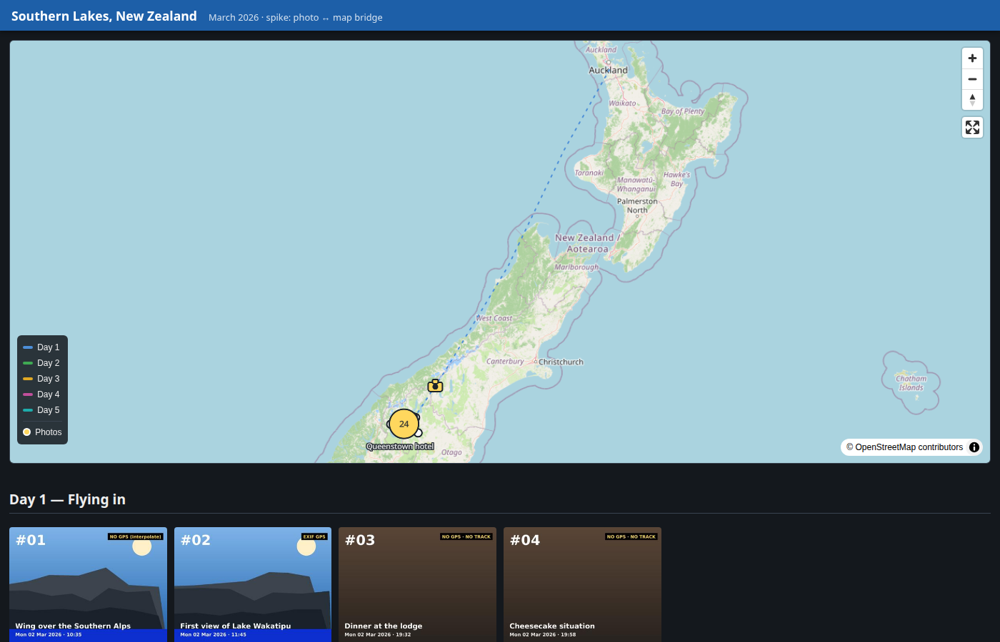
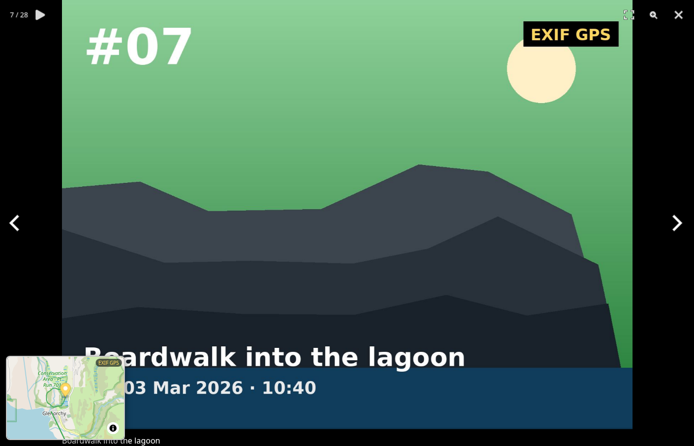

# spike: photo ↔ map bridge

Explores bridging the two halves of the holiday album pages — the interactive
trip map (future: [nomad-path](../nomad-path-fable)) and the PhotoSwipe 5
gallery — into one story. **Outcome and API requirements: see
[LEARNINGS.md](LEARNINGS.md).** A follow-up discussion on how to build the
album site itself (custom build tool vs SSG, media-pipeline caching, trip
index) is written up in [LEARNINGS-site-build.md](LEARNINGS-site-build.md).

Features proven:

- clustered camera markers on the trip map; click → PhotoSwipe opens at that
  photo/video; legend toggle; close → pulse at the last-viewed location
- live minimap inside the PhotoSwipe overlay (tracks + marker + EXIF/≈track
  badge), follows slide navigation & slideshow, survives fullscreen and
  close/reopen, "no location" state for indoor shots
- three-tier location resolution: baked EXIF attrs → timestamp interpolation
  against the GPS track → none




## Run it

```sh
python3 tools/generate.py   # regenerate synthetic data (already committed)
python3 -m http.server 8765
# open http://localhost:8765/
```

## Layout

- `tools/generate.py` — synthetic 5-day NZ trip: geojson (tracks with
  per-point times/elevation, waypoints), PIL-drawn placeholder photos, CC0
  video, and `index.html` baked from `tools/index.template.html`
- `js/map.js` — **nomad-path stand-in** (the API surface is the point)
- `js/bridge.js` — gallery DOM → map markers → `loadAndOpen`
- `js/pswp-minimap-plugin.js` — PhotoSwipe v5 minimap plugin
- `vendor/` — PhotoSwipe 5.3.7 stack copied from the production `website`
  repo (version-faithful) + MapLibre GL 5.24 from nomad-path-fable

Verification: Playwright script (16 end-to-end checks, desktop + mobile
emulation) lives in the session scratchpad; a copy is in
`tools/verify.js`. Run with `node tools/verify.js` (needs a playwright
install with Chromium; the served page on :8765; network for OSM tiles).
